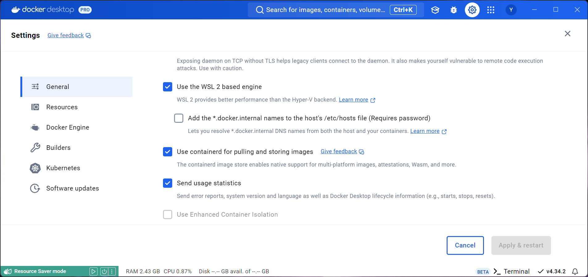

# Workshop Ahead-of-Time

## Software installatie macOS

### JDK 17 of hoger
Controleer de aanwezige Java versie met de volgende commando's:

```bash
$ java --version
java 17.0.11 2024-04-16 LTS

$ javac --version
javac 17.0.11
```

Mocht je geen JDK geinstalleerd hebben (of niet de juiste), dan kun je deze bijvoorbeeld met SDKMAN (https://sdkman.io/)  downloaden installeren. 

Er zijn veel verschillende leveranciers, versies en distributies. Kies bijvoorbeeld GraalVM, GraalVM CE of Temurin. 
Die laatste installeer je met het volgende commando:

```bash
$ sdk install java 17-tem
```
### Docker of Podman
Quarkus maakt gebruik van Docker containers voor onderliggende services tijdens de ontwikkeling van applicaties.
In deze workshop gebruiken we Docker om deze services te beheren en daarom zijn de Docker CLI en Docker Compose vereist.

Mocht je geen Docker (of Podman) geinstalleerd hebben, dan kun je deze downloaden en installeren. Volg de aanwijzingen op Docker.com:
- https://docs.docker.com/docker-for-mac/install/

Als alternatief kun je ook Podman gebruiken. Dit vereist bij het gebruik met Quarkus wat extra stappen,
maar die zijn goed beschreven. Kies je liever Podman in plaats van Docker, volg dan de handleiding van Quarkus: https://quarkus.io/guides/podman

Controlleer de aanwezige software met de volgende commando's:

```bash 
$ docker version

Client:
 Version:           27.2.0
 API version:       1.47
 Built:             Tue Aug 27 14:17:17 2024
 OS/Arch:           macos/arm64
 Context:           desktop-linux

Server: Docker Desktop 4.34.2 (167172)
 Engine:
  Version:          27.2.0
  API version:      1.47 (minimum version 1.24)
...
```

```bash
$ docker compose version

Docker Compose version v2.29.2-desktop.2
```
### Git
We gebruiken Git voor het lokaal werken met de workshopcode. 
Mocht je dit nog niet geinstalleerd hebben, volg dan deze instructies: https://git-scm.com/download

## Software installatie Windows
Om de workshop zelf lokaal te kunnen volgen, dien je de volgende software geinstalleerd te hebben.

### JDK 17 of hoger
Controleer de aanwezige Java versie met de volgende commando's:

```bash
$ java --version
java 17.0.11 2024-04-16 LTS

$ javac --version
javac 17.0.11
```

Mocht je geen JDK geinstalleerd hebben (of niet de juiste), dan kun je deze downloaden en installeren. Volg de aanwijzingen op 1 van de volgende sites:
- https://adoptium.net/installation/
- https://www.graalvm.org/downloads/

### Docker of Podman
Quarkus maakt gebruik van Docker containers voor onderliggende services tijdens de ontwikkeling van applicaties.
In deze workshop gebruiken we Docker om deze services te beheren en daarom zijn de Docker CLI en Docker Compose vereist. 

Mocht je geen Docker (of Podman) geinstalleerd hebben, dan kun je deze downloaden en installeren. Volg de aanwijzingen op Docker.com:
- https://docs.docker.com/docker-for-windows/install/

Als alternatief kun je ook Podman gebruiken. Dit vereist bij het gebruik met Quarkus wat extra stappen, 
maar die zijn goed beschreven. Kies je liever Podman in plaats van Docker, volg dan de handleiding van Quarkus: https://quarkus.io/guides/podman

Controlleer de aanwezige software met de volgende commando's:

```bash 
$ docker version

Client:
 Version:           27.2.0
 API version:       1.47
 Built:             Tue Aug 27 14:17:17 2024
 OS/Arch:           windows/amd64
 Context:           desktop-linux

Server: Docker Desktop 4.34.2 (167172)
 Engine:
  Version:          27.2.0
  API version:      1.47 (minimum version 1.24)
...
```

```bash
$ docker compose version

Docker Compose version v2.29.2-desktop.2
```

### Optioneel: Installeer WSL2 op Windows (Windows Subsystem for Linux)
Wanneer je op Windows werkt is het raadzaam om WSL2 te installeren. Dit vraagt wel een bepaalde versie van Windows 10 of Windows 11, maar als je de stappen in de documentatie volgt kom je er achter of je systeem geschikt is. Het is een optionele stap, maar WSL geeft je wel een fijne omgeving (en betere performance) als je straks verder gaat met het ontwikkelen op Kubernetes.

https://learn.microsoft.com/en-us/windows/wsl/install

Na de installatie van WSL2 kun je in Docker Desktop de integratie inschakelen (wederom via de Docker Desktop settings).



### Git
We gebruiken Git voor het lokaal werken met de workshopcode.
Mocht je dit nog niet geinstalleerd hebben, volg dan deze instructies: https://git-scm.com/download


